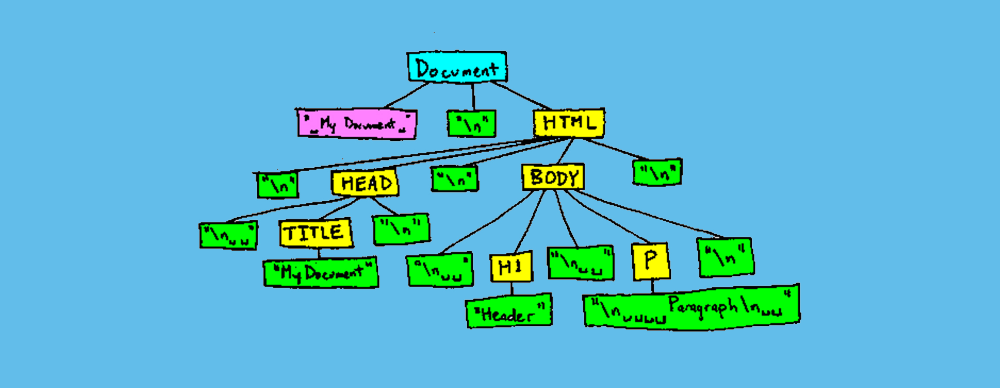

# PilotandoDOM
 Repositório criado para compreensão dos conceitos relacionados ao document object model  DOM

## Aula 01: O que é a DOM

    O que é a DOM?

        *É o HTML convertido para um obejto JavaScript
        *API que representa a interação com HTML
        *Estrutura de daos do tipo árvore, criada pelo browser
    
    Pra que?

        * Javascript usa a DOM para se conectar ao HTML
        * Manipular o HTML com javascript

## Aula 02: Representação visual da DOM

)

## Aula 03: getElementById

    *getElementById: retorna o HTML
    
    *getElementsByClassName: retorna uma lista HTMLCollection
    
    *getElementByTagName: retorna uma lista HTMLCollection
    
    *querySelector: retorna apenas o primeiro nó encontrado
    
    *querySelectorAll: retorna uma nodeList, este aceita o uso do forEach
